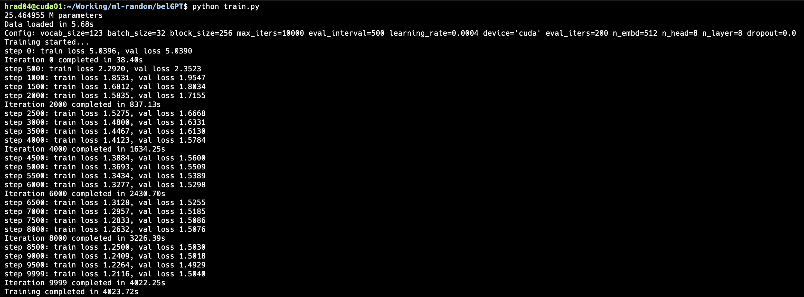

# beLLM


## Introduction

The beLLM or `belarusian Large Language Model (LLM)` is a pretrained generative language model for the Belarusian language. It is based on the previous work
of [RuPoemGPT](https://github.com/gromdimon/ml-random/tree/master/rupoemgpt). The model was trained on a collection of belarusian poems and prose, which
were collected from different sources. For more information about the dataset, please refer to the [dataset](#dataset) section. You can also find the model weights on the [HuggingFace](https://huggingface.co/gromdimon/beLLM) model hub.


## Table of Contents
1. [Project Overview](#project-overview)
2. [Technologies Used](#technologies-used)
3. [Usage](#usage)
4. [Dataset](#dataset)
5. [License](#license)
6. [Acknowledgements](#acknowledgements)


## Project Overview

The beLLM is a character-level language model trained on a collection of belarusian poems and prose.
First inspired by the [nanoGPT](https://github.com/karpathy/nanoGPT) by `Andrej Karpathy`, the model architecture was based on the [GPT-2](https://github.com/openai/gpt-2) by `OpenAI`. 
The data for training was manually collected and preprocessed. The model was trained on a single GPU GeForce GTX 1080 Ti for 1000 epochs.

This repository contains the following core folders&files:
- `model.py`: The main file with the model architecture and training loop.
- `train.py`: The file for training the model.
- `run.py`: The file for generating text with the model.
- `data/`: The folder with the dataset.
- `assets/`: The folder with the images for the README.md.
- `generations/`: The folder with the generated text.
- `models/`: The folder with the results of the training.

The results of the training are available in the `models/` folder. The model weights are available on the [HuggingFace](https://huggingface.co/gromdimon/beLLM) model hub. Here is screenshot of the training process:




## Technologies Used

- **Python**: The primary programming language used for implementing algorithms.
- **Libraries/Frameworks**: PyTorch, NumPy, Pydantic.

All the dependencies are listed in the `Pipfile`.


## Usage

Follow these steps to get your development environment running:

### Prerequisites

Ensure you have `pyenv` and `pipenv` installed on your system. If not, follow these steps:

- Install `pyenv`:
  ```{bash}
  curl https://pyenv.run | bash
  ```

The python version for this project is specified in `.python-version` file. 

- Install `pipenv`:
  ```{bash}
   pip install pipenv
   ```

### Installation

To install the dependencies, you can use Makefile command:

```{bash}
make deps
```

### Training

To train the model you should specify the hyperparameters in the `train.py` file and run the following command:

```{bash}
pipenv run python train.py
```

**Note:** Pay attention to correctly place the data and model paths in the `train.py` file.
**Note:** The training process is very long. It took about 2.5 hours on a single GPU GeForce GTX 1080 Ti for 1000 epochs for a dataset of 9.5 million characters.

### Generation

To generate text with the model you can run the following command:

```{bash}
pipenv run python run.py
```

**Note:** Pay attention to correctly place the model path in the `run.py` file.

Also you can specify the custom input prompt for the generation. Context length in the original implementation is 256 characters. For example:

```{bash}
pipenv run python run.py --prompt "Мая хата"
```

The generated text will be outputted in console and saved in the `generations/` folder.

### Contributing

If you want to contribute to this project, please fork the repository and use a feature branch. Pull requests are warmly welcome.
Before committing any changes, please ensure you have run the pre-commit hooks:

```{bash}
make format
make lint
```

## Dataset

The dataset was collected from different sources and manually preprocessed. It contains over 9.5 million characters and is available in the `data/` folder. The dataset includes the following sources:

- [Belaruskaja Palichka](https://knihi.com/)
- [Ejka](https://ejka.ru/)
- [LitBel](https://lit-bel.org/)
- [RuLit](https://www.rulit.me/)
- [Stihi.by](https://stihi.by/)
- [BelSputnik](https://bel.sputnik.by/)

Some of the authors included in the dataset:
- Maxim Tank (Максім Танк) 
- Yanka Kupala (Янка Купала)
- Yakub Kolas (Якуб Колас)
- Maxim Bogdanovich (Максім Багдановіч)
- Vasyl Bykov (Васіль Быкаў)
- Francishak Bagushevich (Францішак Багушэвіч)
- Yanka Bryl (Янка Брыль)


## License

Distributed under the MIT License. See `LICENSE` for more information.

## Acknowledgements

Big thanks to the following people for their work and inspiration:

- [Andrej Karpathy](https://github.com/karpathy) for the [nanoGPT](https://github.com/karpathy/nanoGPT)
- Anastasija Yashina for creating the dataset
- [ChatGPT](https://chat.openai.com/) for generating the header image
